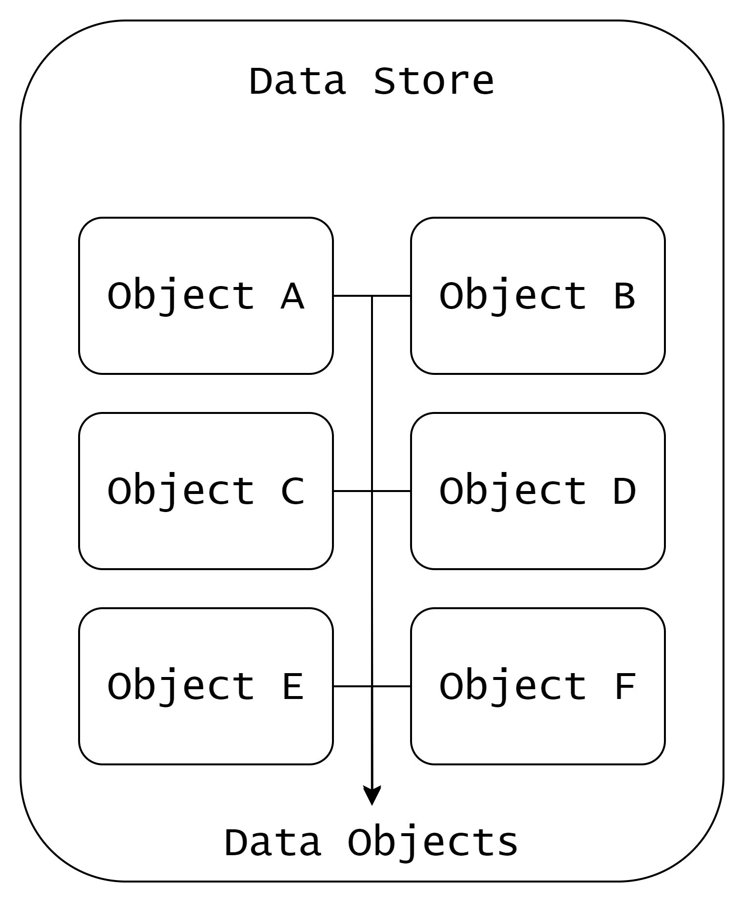
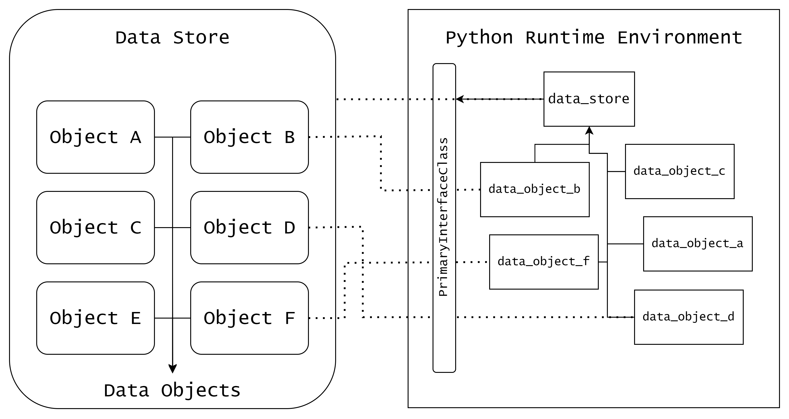

# 📚 Data Access Object (DAO): Progressive Guide to Storage-Agnostic Data Pipelines

## The Problem

Data engineers face a fundamental architectural challenge: **tight coupling between application logic and storage infrastructure**. 

Consider a typical single script data pipeline:


```python
import boto3
import psycopg2
import pandas as pd
import io

# ============ STEP 1: Read from S3 ============
s3_client = boto3.client('s3', region_name='us-east-1')
try:
    response = s3_client.get_object(Bucket='raw-data', Key='customers/2024-01-15.csv')
    csv_buffer = io.BytesIO(response['Body'].read())
    df = pd.read_csv(csv_buffer)
except s3_client.exceptions.NoSuchKey:
    print("File not found in S3")
    exit(1)
except Exception as e:
    print(f"S3 read failed: {e}")
    exit(1)

# ============ STEP 2: Process the data ============
df = df.dropna(subset=['customer_id'])
df = df[df['created_date'] > '2024-01-01']
df['total_spent'] = df['quantity'] * df['price']
# ... complex transformations, aggregations, joins ...
# ... 50+ lines of business logic intertwined with pandas specifics ...
df_processed = df.groupby('customer_id').agg({
    'total_spent': 'sum',
    'order_count': 'count',
    'last_purchase': 'max'
}).reset_index()

# ============ STEP 3: Write to Redshift ============
# Connection strings hardcoded with environment variables scattered
redshift_conn = psycopg2.connect(
    host=os.getenv("REDSHIFT_HOST", "redshift.company.com"),
    database=os.getenv("REDSHIFT_DB", "analytics"),
    user=os.getenv("REDSHIFT_USER", "pipeline_user"),
    password=os.getenv("REDSHIFT_PASSWORD"),  # Must be set in environment
    port=5439
)

cursor = redshift_conn.cursor()

# Redshift requires specific COPY protocol for bulk inserts
try:
    # Create temp table with Redshift-specific DDL
    cursor.execute("""
        CREATE TEMP TABLE temp_customer_metrics (
            customer_id VARCHAR(50),
            total_spent DECIMAL(10, 2),
            order_count INTEGER,
            last_purchase TIMESTAMP
        )
    """)
    
    # Convert dataframe to CSV format (Redshift-specific requirement)
    csv_buffer = io.StringIO()
    df_processed.to_csv(csv_buffer, index=False, header=False)
    csv_buffer.seek(0)
    
    # Use Redshift COPY command (different from standard SQL)
    cursor.copy_expert(
        "COPY temp_customer_metrics FROM STDIN WITH CSV",
        csv_buffer
    )
    
    # Insert from temp to actual table
    cursor.execute("""
        INSERT INTO customer_metrics 
        SELECT * FROM temp_customer_metrics
    """)
    
    redshift_conn.commit()
    print("Successfully wrote to Redshift")
    
except Exception as e:
    redshift_conn.rollback()
    print(f"Redshift write failed: {e}")
    exit(1)
    
finally:
    cursor.close()
    redshift_conn.close()
```

**The cascading problems**:

You now have a pipeline that reads data from a specific S3 bucket, A specific key, processes it with pandas, and writes it to a specific Redshift table. This code is riddled with issues:

-  **Business Logic Tangled with I/O** — Business logic intertwined with I/O concerns (credential management, connection pooling, API calls)
-  **Custom Code for Every System** — Each storage backend needs custom read/write logic, multiplying the pipelines complexity, exploding the number of lines in the codebase
-  **Hard to Test** — Hard to unit test without real S3/Redshift access; mocking becomes complex and brittle
-  **Config Chaos** — Connection strings, credentials, and paths scattered across environment variables, config files, and code
-  **Scaling is Rewriting** — Scaling the pipeline between different storage entities (Redshift tables, S3 buckets) requires rewriting significant portions of the code

The next obvious step would be to create abstractions to hide these complexities. Generally, we try to build our own abstractions using helper functions or wrapper classes.
With this process, we mitigate some issues like **Hard to Test**, **Scaling is Rewriting**, **Config Chaos** mentioned above to an extent.

---

## The "Wrapper Function" Approach

Let's start by creating helper functions to encapsulate S3 reads and Redshift writes.
**File: `storage_helpers.py`** — Wrapper functions organized cleanly

```python
# storage_helpers.py
# "Abstraction" layer with helper functions

import boto3
import psycopg2
import pandas as pd
import io

def read_from_s3(bucket, key):
    """Helper for S3 reads"""
    s3_client = boto3.client('s3')
    try:
        response = s3_client.get_object(Bucket=bucket, Key=key)
        return pd.read_csv(io.BytesIO(response['Body'].read()))
    except s3_client.exceptions.NoSuchKey:
        raise ValueError(f"Key {key} not found in bucket {bucket}")
    except Exception as e:
        raise Exception(f"S3 read error: {e}")

def write_to_redshift(df, table_name, connection_params):
    """Helper for Redshift writes"""
    conn = psycopg2.connect(**connection_params)
    cursor = conn.cursor()
    try:
        # Create temp table with Redshift-specific DDL
        columns_def = ", ".join([f"{col} VARCHAR(255)" for col in df.columns])
        cursor.execute(f"CREATE TEMP TABLE temp_{table_name} ({columns_def})")
        
        # Convert to CSV and use COPY command (Redshift-specific)
        csv_buffer = io.StringIO()
        df.to_csv(csv_buffer, index=False, header=False)
        csv_buffer.seek(0)
        
        cursor.copy_expert(
            f"COPY temp_{table_name} FROM STDIN WITH CSV",
            csv_buffer
        )
        
        cursor.execute(f"INSERT INTO {table_name} SELECT * FROM temp_{table_name}")
        conn.commit()
        
    except Exception as e:
        conn.rollback()
        raise Exception(f"Redshift write error: {e}")
    finally:
        cursor.close()
        conn.close()
```

**File: `customer_pipeline.py`**

```python
# customer_pipeline.py
# Business logic... but still tied to storage

from storage_helpers import read_from_s3, write_to_redshift
import os

def process_customer_data():
    """Our 'clean' business logic"""
    try:
        # Read from S3 (storage-specific)
        df = read_from_s3(bucket="raw-data", key="customers/2024-01-15.csv")
        
        # Process data (business logic mixed with storage knowledge)
        # ... data cleaning, transformations, aggregations ...
        # ... 50+ lines of pandas-specific operations ...
        df = df.dropna(subset=['customer_id'])
        df = df[df['created_date'] > '2024-01-01']
        df['total_spent'] = df['quantity'] * df['price']
        df_processed = df.groupby('customer_id').agg({
            'total_spent': 'sum',
            'order_count': 'count',
            'last_purchase': 'max'
        }).reset_index()
        
        # Write to Redshift (storage-specific, needs connection params)
        redshift_config = {
            'host': os.getenv("REDSHIFT_HOST"),
            'database': os.getenv("REDSHIFT_DB"),
            'user': os.getenv("REDSHIFT_USER"),
            'password': os.getenv("REDSHIFT_PASS"),
            'port': 5439
        }
        write_to_redshift(
            df_processed, 
            table_name="customer_metrics", 
            connection_params=redshift_config
        )
        
        print("Pipeline succeeded")
        
    except ValueError as e:
        print(f"Data error: {e}")
    except Exception as e:
        print(f"Pipeline failed: {e}")

if __name__ == "__main__":
    process_customer_data()
```

The Problem: Why Simple Parameterized Functions Fail at Scale
You've organized your code using parameterized functions. This works well for small pipelines but breaks down as your system grows. You might have observed:

- **Too Many Parameters to Manage** — Every function needs storage details like bucket names, table names, and connection configs passed as parameters. Reading or Writing from a different source requires you to handle different connection parameters, different read/write semantics
- **Different Systems, Different Rules** — Each database or storage system has its own connection rules and ways of reading/writing data.
- **Bloated, Hard-to-Read Functions** — Your functions get packed with parameters, and your main pipeline code knows too much about storage details.
- **Easy to Make Costly Mistakes** — A small typo in a parameter can cause crashes or worse, silent data corruption.
- **Functions Have No Context** — The ```process_customer_data``` function is not context aware, it doesn't understand what it's working with—It blindly calls the helper functions with the parameters provided.

---

## Key Challenges

As you scale data pipelines, you face increasingly complex challenges:

1. **Tight Coupling** — Your pipeline code knows the bucket name, the file format, the connection string. Change any detail, rewrite the code.

2. **Duplicate Logic** — You repeat connection and I/O patterns across different datasets and pipeline stages, leading to maintenance nightmares.

3. **Testing Difficulty** — You can't easily test locally without S3/Redshift credentials and complex setup. Mocking becomes painful.

4. **Switching Costs** — Migrating from one storage backend to another requires rewriting entire pipeline sections, not just configuration.

5. **Scalability Overhead** — As you add more data sources, formats, and destinations, managing them becomes exponentially harder without a systematic approach.

---

## The DAO Solution

DAO flips the script. Instead of your code knowing *how* to talk to storage, you tell DAO *what* data you want. DAO figures out *how*.

### The Three Building Blocks

**1. DataStore** — A ***Data Store*** refers to a complete or a segment of a storage layer which usually are Block storages,
File systems, Object storages or Databases — A logical home for your data

- An S3 bucket, Database schema, or Delta location
- A Filesystem Directory or a Prefix in Object Storage

**2. DataObject** — Unit of data within a DataStore
- A table, file or a object
- Files in a Directory, Tables in a Schema

**3. Interface** — the handler that does the I/O
- Backend-specific implementations
- Each interface knows how to access and perform various operations on all DataObjects in its DataStore
- You don't call interfaces directly; DAO routes to them

### Visual: How They Connect



In this diagram:
- The **large rectangles** = DataStore (logical storage layers)
- The **small rectangles inside** = DataObjects (datasets within each store)
- Each DataObject belongs to exactly one DataStore



In the above diagram, we can see how python objects(Virtual) relate to the Data Store and Data Objects (Real):
- A data store is represented by a DataStore class object
- A data object is represented by a DataObject class object which is associated with a DataStore class object
- Different data stores and data objects have different configurations and properties
- An interface class object is associated with a DataStore class object to perform the data access operations on the DataObjects present in the DataStore
- We can add multiple Interface class objects to a DataStore class object to have multiple ways to access the DataObjects present in the DataStore

- The Data Access Object(DAO) class object is the main entry point to perform data access operations on the DataObjects present in various DataStores
 
### One API, Many Backends

```python
# Same code works for S3, Redshift, Delta, or whatever you add next
dao.read(data_object=my_data)
dao.write(data=df, data_object=my_data, format='parquet')
```

**Why this matters**:
- ✅ **Storage-agnostic code**: Change backends without rewriting pipelines
- ✅ **Clean separation**: I/O logic in interfaces, business logic in your code
- ✅ **Easy configuration**: Register stores once, use them everywhere
- ✅ **Testable**: Mock DataStores and DataObjects for unit testing

---

## 🏛️ The Medallion Architecture: A Real-World Example

Now let's apply DAO to a common data engineering pattern: the **medallion architecture**. Think of it as three zones in a data lake, each serving a different purpose and using different storage.

**The Journey of Data**

Raw data lands → gets cleaned → becomes analytics-ready. Each zone handles one job:

```
┌─────────────────────────────────────────────────────────────────┐
│                    Data's Journey in a Lake                     │
├─────────────────────────────────────────────────────────────────┤
│                                                                 │
│  Raw Sources    Bronze Layer    Silver Layer    Gold Layer      │
│  (CSV, JSON)       (S3)           (S3)          (Redshift)      │
│      │               │              │              │             │
│  users.csv ──>  users_raw  ──>  users_clean  ──>  users_agg    │
│  events.json ─> events_raw ──>  events_enr  ──>  sales_daily   │
│                                                                   │
│  🔴 Raw         🟠 Cleaned      🟡 Optimized    🟢 Analytics    │
│  No schema      De-duped        Partitioned    Ready for BI    │
│  As-is upload   Type-coerced    Indexed         Aggregated      │
│                                                                   │
└─────────────────────────────────────────────────────────────────┘
```

### Layer 1: Bronze — Raw Ingestion

**What lives here**: Source files exactly as received (CSV, JSON, Parquet dumps)

**Your job**: Upload, store, minimal processing

**Storage**: S3 bucket (`bronze_store`)

**Interface**: `S3Boto3Interface` (simple file operations)

**Example DataObjects**:
- `users_raw` → CSV files from user export
- `events_raw` → JSON logs from API

```
S3: bronze_bucket/
├── users_raw/
│   ├── 2025-01-07/users.csv
│   └── 2025-01-08/users.csv
└── events_raw/
    ├── 2025-01-07/events.json
    └── 2025-01-08/events.json
```

### Layer 2: Silver — Cleaned & Structured

**What lives here**: Deduplicated, typed, partitioned Parquet/Delta tables

**Your job**: Transform, validate schema, partition for performance

**Storage**: S3 with Spark (`silver_store`)

**Interface**: `S3SparkInterface` (Spark read/write)

**Example DataObjects**:
- `users_clean` → deduplicated, typed user records
- `events_enriched` → events with added metadata

```
S3: silver_bucket/datasets/
├── users_clean/
│   ├── year=2025/month=01/day=07/part-*.parquet
│   └── year=2025/month=01/day=08/part-*.parquet
└── events_enriched/
    ├── year=2025/month=01/day=07/part-*.parquet
    └── year=2025/month=01/day=08/part-*.parquet
```

### Layer 3: Gold — Analytics Ready

**What lives here**: Aggregated, denormalized, joined tables ready for dashboards and reports

**Your job**: Aggregate, join, create facts/dimensions, optimize for BI queries

**Storage**: Data warehouse (Redshift in this example)

**Interface**: `RedshiftSparkInterface` (bulk load from Spark)

**Example DataObjects**:
- `users_agg` → user metrics (total purchases, account age, etc.)
- `sales_daily_agg` → daily sales rollup by region

```
Redshift: analytics_schema.
├── users_agg
│   Columns: user_id, total_purchases, avg_order_value, ...
├── sales_daily_agg
│   Columns: date, region, revenue, orders, ...
└── (other analytics tables)
```

---

## 🔧 How This Maps to Configuration

Each layer is declared once in a config file. DAO reads this and wires up the right interface for each store.

### The Config File (JSON)

```json
{
  "bronze": {
    "interface_class": "S3Boto3Interface",
    "interface_class_location": "interface_classes.s3.s3_boto3",
    "default_configs": { 
      "bucket": "my-company-bronze" 
    }
  },
  "silver": {
    "interface_class": "S3SparkInterface",
    "interface_class_location": "interface_classes.s3.spark",
    "default_configs": { 
      "bucket": "my-company-silver", 
      "prefix": "datasets" 
    }
  },
  "gold": {
    "interface_class": "RedshiftSparkInterface",
    "interface_class_location": "interface_classes.redshift.spark",
    "default_configs": { 
      "host": "redshift.company.redshift.amazonaws.com",
      "user": "pipeline_user",
      "password": "***",
      "database": "analytics",
      "s3_temp_dir": "s3://my-company-temp/redshift/",
      "iam_role_arn": "arn:aws:iam::123456789:role/redshift-role"
    }
  }
}
```

### How Config Becomes DAO

```
Config (JSON)
    │
    ├─ "bronze" ──> DataStore
    │              ├─ Name: "bronze"
    │              ├─ Interface: S3Boto3Interface
    │              └─ Defaults: { bucket: "my-company-bronze" }
    │
    ├─ "silver" ──> DataStore
    │              ├─ Name: "silver"
    │              ├─ Interface: S3SparkInterface
    │              └─ Defaults: { bucket: "my-company-silver", prefix: "datasets" }
    │
    └─ "gold" ───> DataStore
                   ├─ Name: "gold"
                   ├─ Interface: RedshiftSparkInterface
                   └─ Defaults: { host: "...", user: "...", ... }

Later, when you create DataObjects:

DataObject("users_raw", bronze_store)
    ├─ Name: "users_raw"
    ├─ DataStore: bronze (knows S3Boto3Interface)
    └─ Ready to use: dao.read(users_raw, ...)

DataObject("users_clean", silver_store)
    ├─ Name: "users_clean"
    ├─ DataStore: silver (knows S3SparkInterface)
    └─ Ready to use: dao.read(users_clean, format='parquet')

DataObject("users_agg", gold_store)
    ├─ Name: "users_agg"
    ├─ DataStore: gold (knows RedshiftSparkInterface)
    └─ Ready to use: dao.write(df, users_agg)
```

### What Each Config Field Means

| Field | Purpose | Example |
|-------|---------|---------|
| `interface_class` | The class name that will handle I/O | `S3Boto3Interface` |
| `interface_class_location` | Module path to find the class | `interface_classes.s3.s3_boto3` |
| `default_configs` | Arguments passed to the interface constructor | `{ "bucket": "..." }` |

---

## 💻 Writing the Pipeline Code

Once config is in place, your code becomes simple:

### Step 1: Initialize DAO with Your Config

```python
from dao.core.dao import DataAccessObject
from dao.data_object import DataObject
from dao.data_store import DataStoreRegistry

# Load config (JSON file or dict)
config = {
    "bronze": { ... },  # from above
    "silver": { ... },
    "gold": { ... }
}

# One line: DAO is ready
dao = DataAccessObject(config)
```

### Step 2: Ingest Raw Data to Bronze

```python
# Get the bronze store and create a data object
bronze_store = DataStoreRegistry.get('bronze')
users_raw = DataObject('users_raw', bronze_store)

# Upload a CSV file to S3 (uses S3Boto3Interface under the hood)
with open('sample/users.csv', 'rb') as f:
    dao.write(
        data_object=users_raw, 
        data=f, 
        path='s3://my-company-bronze/users_raw/2025-01-07/'
    )
# ✅ File is now in S3 bronze layer
```

### Step 3: Transform to Silver (With Spark)

```python
# Read from bronze using Spark (S3SparkInterface)
users_df = dao.read(
    data_object=users_raw,
    format='csv'
    # S3SparkInterface knows the bucket/path from defaults
)

# Clean it up
users_clean = (users_df
    .dropDuplicates(['id'])  # remove duplicates
    .select('id', 'name', 'email', 'created_at')  # trim columns
    .filter("email IS NOT NULL")  # remove nulls
)

# Write to silver (parquet, partitioned by date)
silver_store = DataStoreRegistry.get('silver')
users_clean_obj = DataObject('users_clean', silver_store)

dao.write(
    data=users_clean,
    data_object=users_clean_obj,
    format='parquet',
    path='s3://my-company-silver/datasets/users_clean/',
    spark_options={'mode': 'overwrite'}
)
# ✅ Cleaned data is now in S3 silver layer, ready for analytics
```

### Step 4: Load to Gold (Analytics-Ready in Redshift)

```python
# Read from silver
users_clean_data = dao.read(
    data_object=users_clean_obj,
    format='parquet'
)

# Aggregate: compute user metrics
from pyspark.sql.functions import col, count, avg, max

users_agg = (users_clean_data
    .groupBy('id')
    .agg(
        count('*').alias('total_purchases'),
        avg('order_value').alias('avg_order_value'),
        max('created_at').alias('last_purchase_date')
    )
)

# Write to Redshift (gold layer)
gold_store = DataStoreRegistry.get('gold')
users_agg_obj = DataObject('users_agg', gold_store)

dao.write(
    data=users_agg,
    data_object=users_agg_obj,
    format='parquet'  # or spark's native write
)
# ✅ Aggregated metrics now live in Redshift for BI teams
```

### The Full Picture (How Routes Work)

```
Your Code          DAO Router              Interface           Storage
──────────────────────────────────────────────────────────────────────
dao.read(users_raw,
  format='csv')  ──┐
                   ├──> knows users_raw
                   │    is in bronze_store ──> S3Boto3Interface ──> S3
                   │
dao.write(users_clean,
  format='parquet') ─┐
                     ├──> knows users_clean
                     │    is in silver_store ──> S3SparkInterface ──> S3
                     │
dao.write(users_agg) ──┐
                        ├──> knows users_agg
                        │    is in gold_store ──> RedshiftSparkInterface ──> Redshift
```

---

## 🎯 Key Design Patterns

### 1. Object Naming Across Layers
Keep the core entity name consistent, add suffixes for clarity:
- Bronze: `users_raw` (raw CSV/JSON)
- Silver: `users_clean` (cleaned parquet)
- Gold: `users_agg` (aggregated)

### 2. Default Configs Keep Code Clean
Define bucket names, prefixes, and connection strings once in config, not scattered in code:

```python
# Instead of repeating bucket names everywhere:
# ❌ Bad: dao.write(..., path='s3://my-company-silver/datasets/users_clean/')
# ✅ Good: DAO uses config defaults, you just specify data_object and format
```

### 3. Let DAO Route
Pass `format` and `spark_options` only when you need format-specific control. Otherwise, let DAO pick the right interface:

```python
# ✅ Simple: DAO auto-picks interface based on data_object's store
dao.read(data_object=my_data)

# ✅ Specific: You tell DAO the format when needed
dao.read(data_object=my_data, format='parquet')
```

---

## 📖 Next Steps

Ready to see this in action? Check out the example scripts in `examples/medallion/`:
1. `01_ingest_bronze.py` — upload raw data to bronze layer
2. `02_transform_silver.py` — clean and partition to silver layer
3. `03_load_gold.py` — aggregate and load to gold layer (Redshift)

See `catalog.json` for store and object configuration, and `sample_data/` for tiny test datasets.

To run locally:
- **Option A**: Use real AWS S3 (set `AWS_*` env vars)
- **Option B**: Use MinIO + docker-compose (portable, no AWS account needed)

Start with any example script and follow the inline comments.
